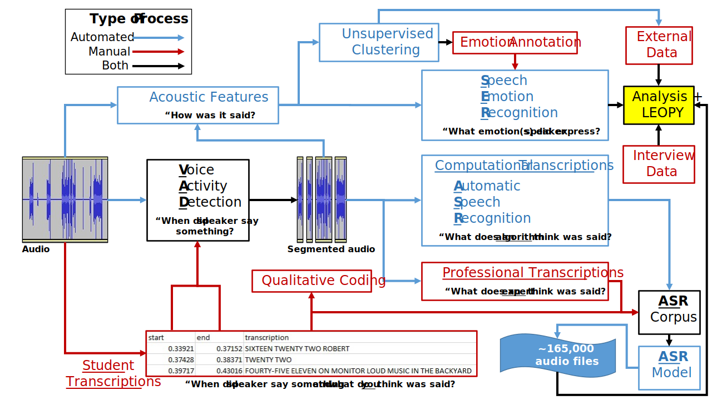

# Language of Policing

This repository exists for collaborative development of code associated with the NIH-funded "Primed to (re)act" project's computational tasks and analysis. This research is supported by the National Institute On Minority Health And Health Disparities of the National Institutes of Health under Award Number R01MD015064. 
## Notebooks/documentation

The `docs` and `notebooks` folders have been created to facilitate documentation and development, respectively. For now, feel free to treat these as scratch spaces, though be sure to define variables like working directories early in the code. 

## Project workflow

