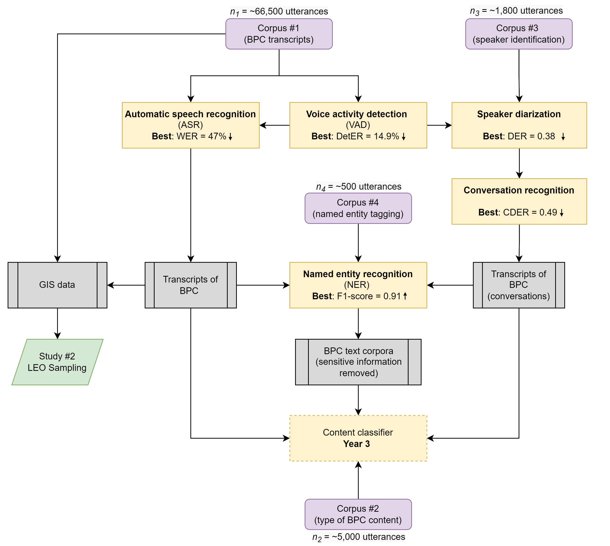

# Language of Policing

This repository exists for collaborative development of code associated with the "Primed to (re)act" project's computational tasks and analysis. Research supported by the National Institute On Minority Health And Health Disparities of the National Institutes of Health under Award Number R01MD015064. The content is solely the responsibility of the authors and does not necessarily represent the official views of the National Institutes of Health.

## Current Performance

Below is a simplified depiction of component dependencies including current performance of each component. 

Note: All metrics are on a 0-100% or 0-1 scale. Arrows in boxes indicate whether better model performance is indicated by higher (↑) or lower (↓) values. 

## Project workflow

Note: Speech emotion recognition (SER) work on pause, workflow does not include speaker diarization or conversation recognition.
